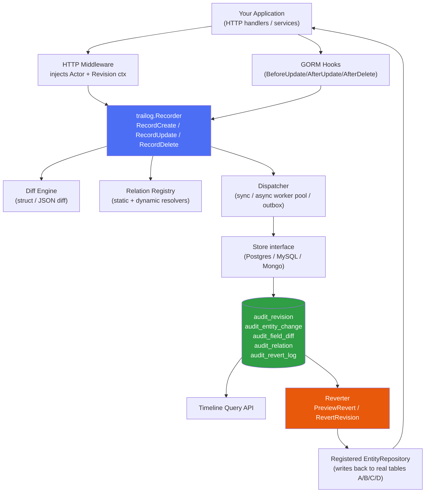
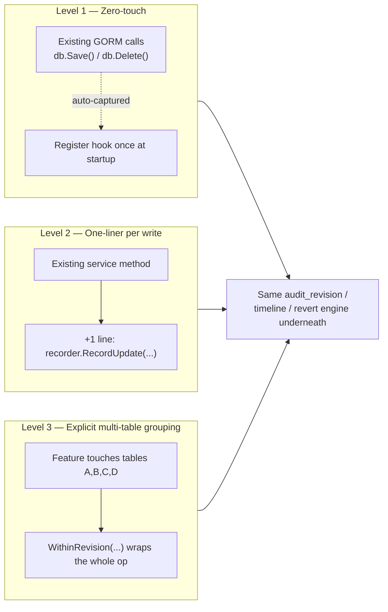
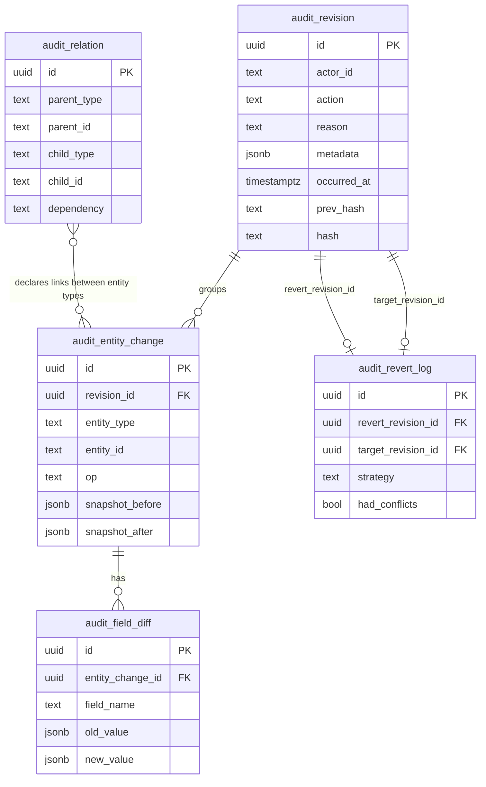
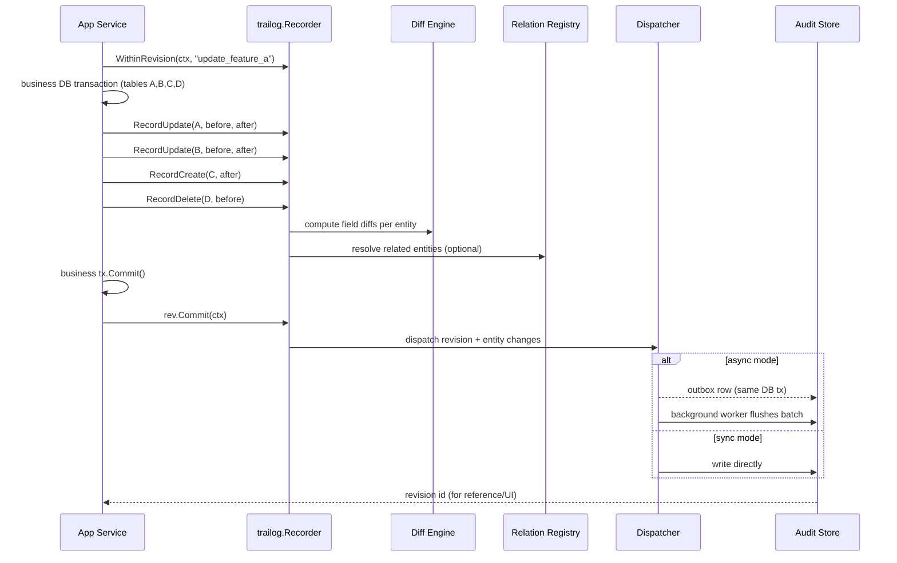
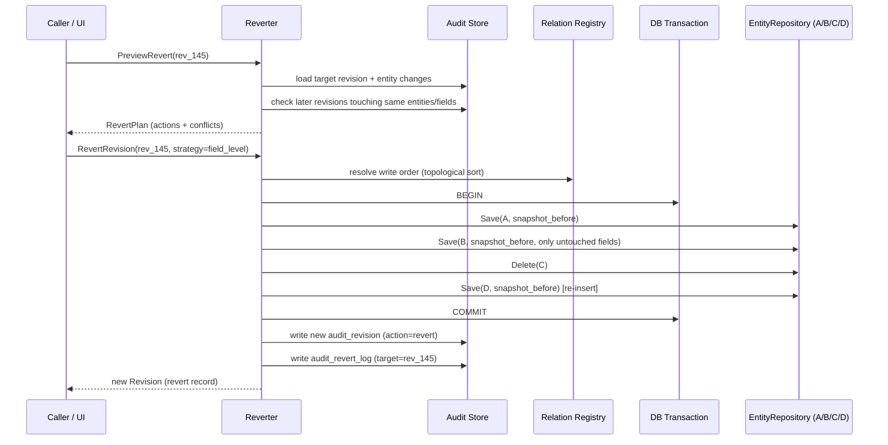
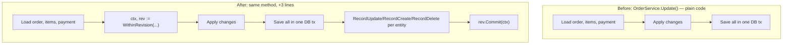
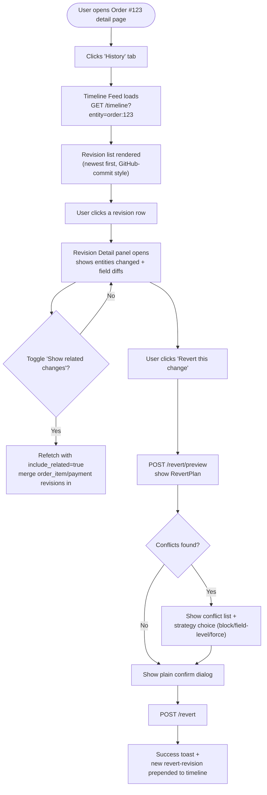
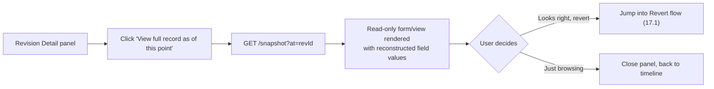
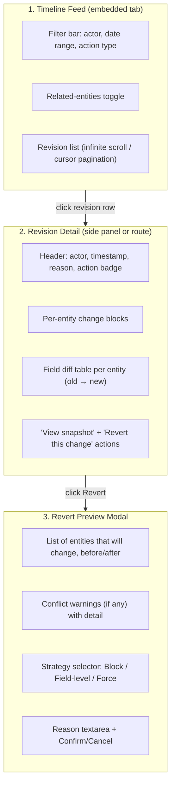

# TRD: Go Audit History Library ("Trailog")
**Technical Requirements Document**
Version 0.1 · Draft

---

## 1. Background & Problem Statement

Standard audit logging usually just dumps "who changed what row at what time" into a flat log table. That's enough for compliance, but not enough to answer:

- "Show me the full history of this record, like a GitHub commit log."
- "What exactly changed field-by-field in this edit?"
- "This record was changed together with 3 other related records in the same action — show them as one group."
- "Let me click through the timeline and see each version's diff."

So this library is not a logger. It's a **change-history engine**: it groups changes into "revisions" (like commits), stores field-level diffs (like a file diff), and links related entities so a timeline can be *followed* across objects, not just viewed per-row.

**Scope of this document:** covers both sides of the feature —
- **§1–§15 (Backend):** library architecture, data model, and integration into services.
- **§16–§20 (Frontend):** UX flows, screens/components, and how the FE consumes the timeline/revert APIs — so BE and FE teams can build from one shared source of truth.

## 2. Goals

| # | Goal |
|---|------|
| G1 | Capture create/update/delete as structured, field-level diffs, not raw before/after blobs only |
| G2 | Group multiple entity changes across **multiple tables** that happen in one logical action into a single atomic "revision" (e.g. one feature edit that touches tables A, B, C, D shows up as one commit-like group, not four unrelated log rows) |
| G3 | Provide a timeline API per-entity and per-related-entity-graph (follow history across linked records) |
| G4 | Pluggable storage (Postgres first, MySQL/Mongo later) |
| G5 | Framework-agnostic core, with optional GORM hook integration |
| G6 | Immutable, tamper-evident history (append-only, optional hash chaining) |
| G7 | Low overhead on the write path (async-safe, non-blocking option) |
| G8 | **Revert / point-in-time restore**: roll one entity, or an entire multi-table revision, back to a prior state — safely, across related tables, without destroying history |

### Non-Goals
- Not a full event-sourcing framework (we don't replay events to rebuild state; we just record diffs against a normal CRUD data store).
- Not a general logging/observability library.
- Not a generic database backup/restore tool — revert (§11) operates on registered entities the app owns, not arbitrary disaster recovery.
- v1 revert does not guarantee atomicity across multiple databases/services — see Open Questions (§16.1).

---

## 3. Core Concepts

Mapping to GitHub mental model:

| GitHub concept | This library |
|---|---|
| Commit | **Revision** (`audit_revision`) — one logical change action, one actor, one timestamp, one message/reason |
| Files changed in a commit | **Entity Changes** (`audit_entity_change`) — each affected entity/table row in that revision |
| Line diff in a file | **Field Diffs** (`audit_field_diff`) — old value → new value per field |
| "Commits touching related files" / PR scope | **Relations** (`audit_relation`) — declared or inferred links between entity types so timelines can be merged |
| Commit history of a file | **Timeline** — query result: all revisions touching one entity (optionally expanded to related entities) |

### 3.1 Revision
One **atomic unit of change** — could be one API request, one form submit, one background job run — that may touch **one or many tables**. This is the key structural answer to "editing feature A actually changes tables A, B, C, D": all four writes are recorded as `EntityChange` rows under the *same single* `Revision`, not as four separate unrelated log entries. Has:
- `id` — also doubles as the grouping key (see §6.7, no separate "correlation id" needed once a revision is explicitly opened)
- `actor` (user/service that made the change)
- `action` (create / update / delete / custom e.g. "approve", "archive")
- `reason` / `message` (optional, like a commit message — useful for approvals, manual overrides)
- `occurred_at`
- `metadata` (IP, request id, source system, etc.)
- `changes[]` — one or more `EntityChange`, each against a different table/entity type

### 3.2 Entity Change
One row/object touched within a revision:
- `entity_type`, `entity_id`
- `revision_id`
- list of `FieldDiff`

### 3.3 Field Diff
- `field_name`, `old_value`, `new_value`, `value_type`
- Supports scalar, JSON, and nested-path diffs (e.g. `address.city`)

### 3.4 Relation
Declares that entity A's timeline should include entity B's changes (or vice versa), e.g.:
- `Invoice` ⟶ `InvoiceItem` (parent/child)
- `Order` ⟶ `Payment` (referenced-by)

Relations can be **static** (declared via struct tags/config) or **dynamic** (resolved at query time via a resolver function you register, e.g. "give me all item IDs for this invoice").

---

## 4. High-Level Architecture



**Read this diagram as two directions:** the top half (App → Recorder → Store → DB) is the **write path** — it only needs your app's existing writes plus one extra call or one registered hook. The bottom half (DB → Timeline/Reverter → EntityRepository → App) is the **read/revert path** — it needs nothing from your app except the small `EntityRepository` adapters if you want revert support. Viewing-only integrations can skip `EntityRepository` entirely.

---

## 5. Integration Model — Designed to Drop Into an Existing Feature

The library is built so an existing feature's code barely changes. Three integration levels, from "almost zero code" to "full control":



| Level | When to use | Code needed |
|---|---|---|
| **1. Zero-touch (GORM hooks)** | Simple single-table entities where "before/after row" is enough | One line at startup: `trailog.RegisterGORMHooks(db, tl, "invoice")` — no changes inside business logic |
| **2. One-liner** | A single-table update where you want a custom `reason`/metadata, or you're not using GORM | One `recorder.RecordUpdate(ctx, ...)` call after the existing save |
| **3. Explicit multi-table** | The "Feature A touches tables A, B, C, D" case | Wrap the existing method body with `WithinRevision(...)` / `rev.Commit(ctx)` (see §15 for a full example) |

You can mix all three in the same app — most entities use Level 1, a handful of "feature" flows that fan out across tables use Level 3.

### 5.1 Minimal setup (one place, at app startup)

```go
tl, err := trailog.New(
    trailog.WithPostgresStore(db),                          // storage backend
    trailog.WithRelation("order", "order_item", "has_items", trailog.ChildDependsOnParent),
    trailog.WithRelation("order", "payment", "has_payment", trailog.ChildDependsOnParent),
    trailog.WithRepository("order", orderRepoAdapter{db}),   // needed only if you want revert
    trailog.WithRepository("order_item", itemRepoAdapter{db}),
    trailog.WithRepository("payment", paymentRepoAdapter{db}),
    trailog.WithAsyncOutbox(db),                             // optional, for non-blocking writes
)
if err != nil {
    log.Fatal(err)
}

router.Use(trailog.HTTPMiddleware(tl, trailog.ActorFromJWT)) // injects Actor into ctx per request
```

That's the entire integration surface for a new service. Everything else (diffing, storage, timeline, revert) is handled internally — your feature code only ever talks to `tl.Recorder()`, `tl.Timeline()`, or `tl.Reverter()`.

---

## 6. Package Layout (Go module)

```
trailog/
├── trailog.go            // Recorder interface, top-level Record* funcs
├── actor.go              // Actor type, context helpers (WithActor, ActorFromCtx)
├── revision.go           // Revision, EntityChange, FieldDiff types
├── diff/
│   ├── diff.go           // reflect-based struct differ
│   ├── json_diff.go      // map[string]interface{} / JSON differ
│   └── tags.go           // `trailog:"track"` / `trailog:"-"` / `trailog:"mask"` tag parsing
├── relation/
│   ├── relation.go       // Relation registry, static + resolver-based
│   └── graph.go          // BFS traversal for "expand timeline to related entities"
├── store/
│   ├── store.go          // Store interface
│   ├── postgres/         // Postgres implementation + migrations
│   ├── mysql/
│   └── mongo/
├── timeline/
│   ├── query.go          // TimelineQuery, filters, pagination
│   └── group.go          // Groups entity changes back into revision "commits"
├── integration/
│   ├── gormhook/         // GORM callback integration
│   └── httpmw/           // net/http & common router middleware for Actor context
├── outbox/               // optional: transactional outbox for reliable async writes
└── examples/
    ├── basic/
    └── related-entities/
```

---

## 7. Core API Design

### 7.1 Context & Actor

```go
type Actor struct {
    ID     string
    Type   string // "user", "system", "api_key"
    Name   string
    Email  string
    IP     string
    Extra  map[string]any
}

func WithActor(ctx context.Context, a Actor) context.Context
func ActorFromContext(ctx context.Context) (Actor, bool)

// Groups multiple entity changes in one request/transaction into one Revision
func WithCorrelationID(ctx context.Context, id string) context.Context
```

### 7.2 Recorder

```go
type Recorder interface {
    RecordCreate(ctx context.Context, entity Entity, after any, opts ...Option) error
    RecordUpdate(ctx context.Context, entity Entity, before, after any, opts ...Option) error
    RecordDelete(ctx context.Context, entity Entity, before any, opts ...Option) error
    RecordCustom(ctx context.Context, entity Entity, action string, before, after any, opts ...Option) error
}

type Entity struct {
    Type string // "invoice", "order", ...
    ID   string
}

type Option func(*recordOptions)

func WithReason(msg string) Option
func WithMetadata(kv map[string]any) Option
func WithFieldMask(fields ...string) Option // exclude sensitive fields at call site
```

### 7.3 Diff Types

```go
type Revision struct {
    ID            string
    CorrelationID string
    Actor         Actor
    Action        string
    Reason        string
    OccurredAt    time.Time
    Metadata      map[string]any
    Changes       []EntityChange
}

type EntityChange struct {
    ID         string
    RevisionID string
    Entity     Entity
    Fields     []FieldDiff
}

type FieldDiff struct {
    Field    string // supports dot-path: "address.city"
    OldValue any
    NewValue any
    Type     string // "string","number","bool","json","array"
}
```

### 7.4 Diff Engine tagging (struct-based capture)

```go
type Invoice struct {
    ID       string  `trailog:"id"`
    Amount   float64 `trailog:"track"`
    Status   string  `trailog:"track"`
    Notes    string  `trailog:"track"`
    APIToken string  `trailog:"-"`     // never tracked
    Password string  `trailog:"mask"`  // tracked as changed, but value redacted
}
```

The diff engine uses reflection (with a cached type-info map for performance) to walk struct fields, respecting tags, and produces `[]FieldDiff` by comparing `before` vs `after`. Nested structs/slices fall back to JSON diff if not explicitly tracked field-by-field.

### 7.5 Multi-Table Revision Scoping ("one feature edit, many tables")

For the "feature A actually edits tables A, B, C, D" case, don't rely on an implicit correlation id passed around — **open a revision explicitly** at the start of the business operation, record every entity touched inside it, then commit it once at the end. This guarantees all four table changes land in exactly one revision, in the order they happened, even if they're recorded from different service/repository methods deep in the call stack.

```go
type RevisionHandle interface {
    // Record calls made with the returned ctx are buffered against this revision
    Commit(ctx context.Context) error // flushes revision + all buffered entity changes atomically
    Discard()                         // drop everything if the business transaction failed
}

func (r *recorder) WithinRevision(ctx context.Context, action, reason string, opts ...Option) (context.Context, RevisionHandle)
```

Usage — a single "update feature A" request that cascades into 4 tables:

```go
func (s *FeatureAService) Update(ctx context.Context, in UpdateInput) error {
    ctx, rev := s.recorder.WithinRevision(ctx, "update_feature_a", "user edited Feature A form")
    defer rev.Discard() // no-op if Commit() already succeeded

    return s.db.Transaction(func(tx *gorm.DB) error {
        beforeA, afterA := s.repoA.Update(tx, in.A)
        s.recorder.RecordUpdate(ctx, Entity{"table_a", in.A.ID}, beforeA, afterA)

        beforeB, afterB := s.repoB.Update(tx, in.B)
        s.recorder.RecordUpdate(ctx, Entity{"table_b", in.B.ID}, beforeB, afterB)

        afterC := s.repoC.Create(tx, in.C)
        s.recorder.RecordCreate(ctx, Entity{"table_c", afterC.ID}, afterC)

        beforeD := s.repoD.Delete(tx, in.D.ID)
        s.recorder.RecordDelete(ctx, Entity{"table_d", in.D.ID}, beforeD)

        if err := tx.Commit().Error; err != nil {
            return err // rev.Discard() runs via defer, nothing is persisted to audit store
        }
        return rev.Commit(ctx) // one audit_revision row, four audit_entity_change rows
    })
}
```

Notes:
- `RecordUpdate/Create/Delete` calls made with `ctx` derived from `WithinRevision` are buffered in memory (not written yet) until `Commit(ctx)`.
- `Commit` should be called **after** the business DB transaction commits successfully — this avoids recording an audit trail for a change that never actually happened. If you need the audit write to be part of the *same* DB transaction for strict consistency, use the **outbox variant** (§9): `Commit` writes an outbox row inside `tx` instead of directly to the audit store, and a background worker flushes it after `tx` commits.
- If `WithinRevision` is never explicitly used, the library falls back to the old implicit behavior: each `Record*` call with the same `CorrelationID` in context still gets merged into one revision (upsert-by-correlation-id), for simpler call sites that don't need the buffered/committed pattern.

### 7.6 Repository Registry (needed for revert to actually write data back)

Recording diffs only requires knowing *what* changed. Reverting requires the library to be able to *write the old value back* into the real table. So each entity type needs a small adapter registered once at startup:

```go
type EntityRepository interface {
    Load(ctx context.Context, id string) (any, error)
    Save(ctx context.Context, entity any) error   // used to restore an update/delete
    Delete(ctx context.Context, id string) error  // used to undo a create
}

type RepositoryRegistry interface {
    Register(entityType string, repo EntityRepository)
}
```

```go
registry.Register("table_a", tableARepoAdapter{db: db})
registry.Register("table_b", tableBRepoAdapter{db: db})
```

Without a registered repository for an entity type, that entity's history can still be **viewed** (timeline/diff) but not **reverted** — the revert engine will report it as unsupported rather than silently skipping it.

### 7.7 Reverter (point-in-time restore)

A revert is implemented as **git-revert semantics, not git-reset**: it creates a *new* revision whose diffs are the inverse of the target, so history stays intact and you can see "this was reverted, by whom, when, and why" — never rewrites or deletes old rows.

```go
type RevertStrategy string

const (
    StrategyForceOverwrite RevertStrategy = "force"       // ignore later changes, restore target state as-is
    StrategyFieldLevel     RevertStrategy = "field_level" // only touch fields that haven't been changed again since target
    StrategyBlockOnConflict RevertStrategy = "block"      // (default) fail with a Conflict list; caller decides
)

type Reverter interface {
    // Dry run: shows exactly what would change and any conflicts, without writing anything
    PreviewRevert(ctx context.Context, revisionID string, opts ...RevertOption) (*RevertPlan, error)

    // Revert a whole multi-table revision back to its pre-change state (undoes all entities in it)
    RevertRevision(ctx context.Context, revisionID string, opts ...RevertOption) (*Revision, error)

    // Revert a single entity to its state as of a specific past revision
    RevertEntity(ctx context.Context, entity Entity, toRevisionID string, opts ...RevertOption) (*Revision, error)
}

type RevertOption func(*revertOptions)
func WithStrategy(s RevertStrategy) RevertOption
func WithCascade(depth int) RevertOption // also revert related entities (via RelationRegistry), not just the one entity
func WithReason(msg string) RevertOption

type RevertPlan struct {
    TargetRevisionID string
    Actions          []RevertAction
    Conflicts        []Conflict
}

type RevertAction struct {
    Entity      Entity
    Op          string // "restore_update" | "restore_delete" (undo a create) | "restore_create" (undo a delete)
    FromState   map[string]any // current values
    ToState     map[string]any // values it will become
    HasConflict bool
}

type Conflict struct {
    Entity      Entity
    Field       string
    TargetValue any // value at the revision being reverted to
    CurrentValue any // value right now
    ChangedBy   []Revision // revisions that touched this field after the target — i.e. what you'd be discarding
}
```

**Why conflicts matter (multi-table case):** if you revert "update feature A" (tables A, B, C, D) but table B was independently edited by someone else *after* that revision, force-restoring B's old values would silently wipe out that later legitimate edit. `StrategyBlockOnConflict` (the default) stops and reports it via `Conflicts`; `StrategyFieldLevel` only restores fields on B that are still untouched since the target revision; `StrategyForceOverwrite` restores everything regardless — useful for "undo my mistake immediately" flows where you've confirmed nothing else changed.

**Ordering across tables:** when applying a revert that spans multiple tables (e.g. undoing a delete on a parent + its children, or an update that cascaded), the engine topologically sorts entities using the same dependency info as `RelationRegistry` (§6.8) so writes happen in referentially-safe order — parents restored/created before children that reference them; children removed before parents when undoing a create.

**Scope of v1:** revert executes inside a single database transaction. If tables A–D live in the same database, this is a normal DB transaction wrapping calls to each registered `EntityRepository`. If they span multiple databases/services, v1 does not guarantee atomicity — that requires a saga/compensation pattern and is deferred to a later phase (flagged in Open Questions).

### 7.8 Relations (linking for "follow history")

```go
type Dependency string

const (
    ChildDependsOnParent Dependency = "child_depends_on_parent" // e.g. invoice_item.invoice_id -> invoice.id (FK)
    Independent          Dependency = "independent"             // no write-order constraint
)

type RelationRegistry interface {
    // Static declaration: Invoice --has_many--> InvoiceItem
    // dependency tells the revert engine which side must be written first to satisfy FK constraints
    Declare(parentType, childType, relationName string, dependency Dependency)

    // Dynamic resolver: given an entity, return related entity IDs at query time
    RegisterResolver(entityType string, fn func(ctx context.Context, e Entity) ([]Entity, error))
}
```

Example:
```go
registry.Declare("invoice", "invoice_item", "has_items", trailog.ChildDependsOnParent)
registry.RegisterResolver("invoice", func(ctx context.Context, e Entity) ([]Entity, error) {
    items, _ := invoiceRepo.ItemIDs(ctx, e.ID)
    related := make([]Entity, len(items))
    for i, id := range items {
        related[i] = Entity{Type: "invoice_item", ID: id}
    }
    return related, nil
})
```

### 7.9 Timeline Query API

```go
type TimelineQuery struct {
    Entity        Entity
    IncludeRelated bool
    RelationDepth  int      // how many hops to follow (default 1)
    ActorID        string   // filter
    From, To       time.Time
    Actions        []string
    Limit, Cursor  string   // cursor-based pagination
}

type TimelineService interface {
    GetTimeline(ctx context.Context, q TimelineQuery) (*TimelineResult, error)
    GetRevision(ctx context.Context, revisionID string) (*Revision, error)
    Diff(ctx context.Context, entity Entity, fromRevID, toRevID string) ([]FieldDiff, error)
}

type TimelineResult struct {
    Revisions  []Revision // already grouped, newest first
    NextCursor string
}
```

This is what powers a GitHub-like UI: a list of "commits" (revisions), each expandable to show which entities changed and the field diffs, with an option to widen the view to related entities.

---

## 8. Database Schema (Postgres reference)



```sql
-- One row per logical change action (a "commit")
CREATE TABLE audit_revision (
    id              UUID PRIMARY KEY DEFAULT gen_random_uuid(),
    correlation_id  UUID NOT NULL,          -- groups revisions from same request/tx if split
    actor_id        TEXT,
    actor_type      TEXT,
    actor_name      TEXT,
    action          TEXT NOT NULL,          -- create/update/delete/custom
    reason          TEXT,
    metadata        JSONB DEFAULT '{}',
    occurred_at     TIMESTAMPTZ NOT NULL DEFAULT now(),
    prev_hash       TEXT,                   -- for tamper-evidence chain (optional)
    hash            TEXT
);
CREATE INDEX idx_revision_correlation ON audit_revision (correlation_id);
CREATE INDEX idx_revision_occurred_at ON audit_revision (occurred_at DESC);
CREATE INDEX idx_revision_actor ON audit_revision (actor_id);

-- One row per entity touched within a revision (a "file changed")
CREATE TABLE audit_entity_change (
    id              UUID PRIMARY KEY DEFAULT gen_random_uuid(),
    revision_id     UUID NOT NULL REFERENCES audit_revision(id),
    entity_type     TEXT NOT NULL,
    entity_id       TEXT NOT NULL,
    op              TEXT NOT NULL,          -- create | update | delete
    snapshot_before JSONB,                  -- full entity state before this change (NULL for create)
    snapshot_after  JSONB,                  -- full entity state after this change (NULL for delete)
    created_at      TIMESTAMPTZ NOT NULL DEFAULT now()
);
CREATE INDEX idx_entity_change_entity ON audit_entity_change (entity_type, entity_id, created_at DESC);
CREATE INDEX idx_entity_change_revision ON audit_entity_change (revision_id);

-- One row per changed field within an entity change (a "diff line")
CREATE TABLE audit_field_diff (
    id                UUID PRIMARY KEY DEFAULT gen_random_uuid(),
    entity_change_id  UUID NOT NULL REFERENCES audit_entity_change(id),
    field_name        TEXT NOT NULL,
    old_value         JSONB,
    new_value         JSONB,
    value_type        TEXT
);
CREATE INDEX idx_field_diff_entity_change ON audit_field_diff (entity_change_id);

-- Declares which entity types are linked, so timelines can be merged/followed
-- AND which side must be written first on revert (mirrors FK direction)
CREATE TABLE audit_relation (
    id              UUID PRIMARY KEY DEFAULT gen_random_uuid(),
    parent_type     TEXT NOT NULL,
    parent_id       TEXT NOT NULL,
    child_type      TEXT NOT NULL,
    child_id        TEXT NOT NULL,
    relation_name   TEXT NOT NULL,
    dependency      TEXT NOT NULL DEFAULT 'child_depends_on_parent', -- or 'independent'
    created_at      TIMESTAMPTZ NOT NULL DEFAULT now()
);
CREATE INDEX idx_relation_parent ON audit_relation (parent_type, parent_id);
CREATE INDEX idx_relation_child ON audit_relation (child_type, child_id);

-- Traceability for reverts: every revert IS a new audit_revision (git-revert style),
-- this table just links "this revision was a revert, and of what"
CREATE TABLE audit_revert_log (
    id                  UUID PRIMARY KEY DEFAULT gen_random_uuid(),
    revert_revision_id  UUID NOT NULL REFERENCES audit_revision(id), -- the NEW revision created by reverting
    target_revision_id  UUID NOT NULL REFERENCES audit_revision(id), -- the revision it reverted to/undid
    strategy            TEXT NOT NULL,      -- force | field_level | block
    had_conflicts       BOOLEAN NOT NULL DEFAULT false,
    conflict_detail     JSONB,              -- resolved/overridden conflicts, for audit of the audit
    created_at          TIMESTAMPTZ NOT NULL DEFAULT now()
);
CREATE INDEX idx_revert_log_target ON audit_revert_log (target_revision_id);
```

**Design notes:**
- `snapshot_before`/`snapshot_after` (JSONB) on `audit_entity_change` are effectively **mandatory once revert is a requirement** — the revert engine restores from these snapshots directly instead of replaying every diff since the beginning of time. This trades storage for both read speed *and* revert correctness/simplicity.
- `op` distinguishes create/update/delete per entity change, which the revert engine needs to know whether reverting means "delete this row" (undo a create), "re-insert this row" (undo a delete), or "write old field values back" (undo an update).
- `audit_relation.dependency` mirrors real FK direction so the revert engine can topologically sort multi-table writes safely — this is what makes "revert an action that touched A, B, C, D" apply changes in the right order instead of hitting FK violations.
- `audit_revert_log` means a revert is fully traceable: you can see in the timeline "Revision #145 reverted Revision #132 (strategy: field_level, 1 conflict auto-resolved)" — history is never silently rewritten.
- `audit_relation` can be populated by your app when relationships are created/changed, or generated on-the-fly at query time using resolvers if you don't want to persist the graph (resolver-based relations don't get dependency ordering automatically — supply it via `RegisterResolver` metadata if you need revert-cascade to use them).
- Partition `audit_entity_change` and `audit_field_diff` by month/quarter if volume is high (Postgres native partitioning on `created_at`), since audit data is append-heavy and time-ordered.
- `prev_hash` / `hash` per revision (hash of revision content + previous hash) gives a lightweight tamper-evidence chain, similar in spirit to git commit hashing — optional, but valuable for compliance-grade "history cannot be silently edited" guarantees.

---

## 9. Write Path: How a Change Gets Recorded



1. Request comes in → HTTP middleware sets `Actor` and generates a `CorrelationID` into `context.Context`.
2. Business logic loads the entity (`before`), applies changes, saves (`after`).
3. Either:
   - **Manual call:** `recorder.RecordUpdate(ctx, Entity{"invoice", id}, before, after)`, or
   - **GORM hook:** `AfterUpdate` callback automatically captures `before`/`after` from GORM's change tracking and calls the recorder for you.
4. Recorder runs the **diff engine** → produces `[]FieldDiff`. If nothing actually changed, no revision is written (avoids noise).
5. Recorder resolves relations (static declarations + dynamic resolvers) to optionally pre-populate `audit_relation` rows.
6. Recorder hands off to the **dispatcher**:
   - **Sync mode:** writes directly in the same DB transaction as the business write (strong consistency, slightly higher latency).
   - **Async mode:** pushes to a buffered channel / worker pool, or a transactional outbox table written in the same DB transaction, then flushed to the audit store by a background worker (better latency, eventual consistency for the audit trail).
7. Store persists `audit_revision` + `audit_entity_change` + `audit_field_diff` rows (batched insert).

```go
// Sync usage inside a service method
func (s *InvoiceService) UpdateStatus(ctx context.Context, id string, status string) error {
    before, err := s.repo.Get(ctx, id)
    ...
    after := before
    after.Status = status
    if err := s.repo.Save(ctx, after); err != nil {
        return err
    }
    return s.recorder.RecordUpdate(ctx,
        trailog.Entity{Type: "invoice", ID: id},
        before, after,
        trailog.WithReason("manual status override"),
    )
}
```

---

## 10. Read Path: Building the GitHub-Style Timeline UI

`GetTimeline` groups rows back into revisions and returns them newest-first, e.g.:

```json
{
  "revisions": [
    {
      "id": "rev_123",
      "actor": { "name": "Dimas", "type": "user" },
      "action": "update",
      "reason": "fix wrong tax amount",
      "occurred_at": "2026-09-04T10:15:00Z",
      "changes": [
        {
          "entity": { "type": "invoice", "id": "inv_1" },
          "fields": [
            { "field": "amount", "old_value": 100000, "new_value": 120000 },
            { "field": "status", "old_value": "draft", "new_value": "sent" }
          ]
        },
        {
          "entity": { "type": "invoice_item", "id": "item_9" },
          "fields": [
            { "field": "qty", "old_value": 1, "new_value": 2 }
          ]
        }
      ]
    }
  ],
  "next_cursor": "rev_098"
}
```

Notice `rev_123` shows changes to **both** the invoice and one of its items in a single grouped revision — that's the "commit touching multiple files" feel, achieved because both writes shared the same `CorrelationID` inside one request.

For "follow related history" (`IncludeRelated: true`), the query engine:
1. Resolves related entities via `RelationRegistry` (static + dynamic resolvers), up to `RelationDepth` hops.
2. Unions their revisions with the primary entity's revisions.
3. Sorts merged results by `occurred_at DESC` and paginates.

---

## 11. Revert Execution Flow (multi-table)



Walking through the earlier "feature A touches tables A, B, C, D" example — say someone now wants to undo Revision #145:

1. **Load the target revision.** Fetch `audit_revision #145` and all its `audit_entity_change` rows: table A (update), table B (update), table C (create), table D (delete).
2. **Build the revert plan.** For each entity change, compute the inverse operation:
   - Table A/B (`update`) → inverse is "write `snapshot_before` back"
   - Table C (`create`) → inverse is "delete this row"
   - Table D (`delete`) → inverse is "re-insert `snapshot_before`"
3. **Check for conflicts.** For each entity, look up whether any *later* revision touched the same entity/fields. If so, and strategy is `block` (default), collect a `Conflict` and stop before writing anything. If `field_level`, restrict the inverse write to only the fields untouched since #145. If `force`, proceed regardless.
4. **Resolve write order.** Use `RelationRegistry` dependency info to topologically sort the four entities: e.g., if D is a child of A (`child_depends_on_parent`), D's re-insert must happen *after* A's restore; if C (being deleted) was a child of B, C's delete must happen *before* any change to B in case of restrict-style FK constraints.
5. **Apply atomically.** Open one DB transaction; for each entity in resolved order, call its registered `EntityRepository.Save/Delete`. If any step fails, roll back everything — a partial revert across tables is worse than no revert.
6. **Record the revert as a new revision.** On success, write a brand-new `audit_revision` (action = `"revert"`, reason = caller-supplied or auto-generated `"Reverted revision #145"`), one `audit_entity_change` per entity actually changed (with the *new* current values as `snapshot_after`), and one `audit_revert_log` row linking it back to #145.

```go
plan, err := reverter.PreviewRevert(ctx, "rev_145")
if len(plan.Conflicts) > 0 {
    // surface to the user: "table_b.status was changed again by Rina on 2026-09-03 — revert anyway?"
}
newRev, err := reverter.RevertRevision(ctx, "rev_145",
    trailog.WithStrategy(trailog.StrategyFieldLevel),
    trailog.WithReason("rolling back bad Feature A deploy"),
)
```

The result: the timeline now shows both #145 (the original change) and the new revert revision, each with full field diffs, exactly like `git revert` leaves both the original commit and the revert commit visible in `git log`.

---

## 12. HTTP API Surface (if exposed as a service, not just embedded library)

| Endpoint | Purpose |
|---|---|
| `GET /entities/{type}/{id}/timeline` | Paginated revision list for one entity |
| `GET /entities/{type}/{id}/timeline?include_related=true&depth=2` | Timeline including related entities |
| `GET /revisions/{id}` | Full detail of one revision (all entities/fields changed) |
| `GET /entities/{type}/{id}/diff?from={revA}&to={revB}` | Field diff between two points in time |
| `GET /entities/{type}/{id}/snapshot?at={revId}` | Reconstructed state as of a given revision |
| `POST /revisions/{id}/revert/preview` | Dry-run a revert, returns `RevertPlan` with conflicts |
| `POST /revisions/{id}/revert` | Execute the revert (body: `strategy`, `reason`) |

---

## 13. Non-Functional Requirements

| Concern | Approach |
|---|---|
| **Performance** | Async dispatch (channel + worker pool, or outbox pattern) so audit writes don't block the main transaction latency; batched inserts |
| **Consistency** | Outbox pattern (write an "audit intent" row in the same DB transaction as the business change, background worker publishes it) avoids losing audit records if the process crashes right after commit |
| **Storage growth** | Time-based partitioning + retention/archival policy (e.g., move revisions older than N months to cold storage/S3 as compressed JSON) |
| **Integrity** | Append-only tables (no UPDATE/DELETE grants for the app's DB role on audit tables), optional hash chaining per revision |
| **Sensitive data** | `trailog:"mask"` tag redacts values in diffs (store `"***"` or a hash instead of the raw value) while still recording *that* a change happened |
| **Scalability** | Store interface allows swapping Postgres → dedicated audit DB / ClickHouse for very high volume, without changing the Recorder/Diff/Timeline API |
| **Testability** | In-memory `Store` implementation for unit tests |
| **Revert safety** | Revert always runs inside one DB transaction across all affected tables (all-or-nothing); conflicts are surfaced before any write via `PreviewRevert`; every revert is itself a recorded, attributable revision — never a silent history rewrite |

---

## 14. Rollout Plan (Phased)

**Phase 1 — Core library**
- `trailog` core types, `diff` engine (struct-based), in-memory + Postgres store
- Manual `Recorder` calls, synchronous write path, mandatory `snapshot_before`/`snapshot_after`
- Basic `GetTimeline` (single entity, no relations)

**Phase 2 — Multi-Table Grouping & Relations**
- `WithinRevision` explicit scoping so one feature edit spanning multiple tables lands in one revision
- `RelationRegistry` (static + resolver, with `Dependency` direction), `IncludeRelated` timeline queries
- GORM hook integration

**Phase 3 — Revert**
- `Reverter`: `PreviewRevert`, `RevertRevision`, `RevertEntity`
- Conflict detection (`block` / `field_level` / `force` strategies)
- `EntityRepository` adapters + topological write ordering across tables
- `audit_revert_log` traceability

**Phase 4 — Reliability & Scale**
- Outbox pattern for async writes (and for transactionally-safe revert commit)
- Table partitioning + retention/archival jobs
- Hash chaining for tamper-evidence

**Phase 5 — DX & UI**
- REST API layer for timeline/diff/snapshot/revert
- Reference UI component (timeline feed + expandable diff view + "Revert" button with conflict preview, GitHub-commit style)
- CLI tool to inspect/export audit history

---

## 15. Full Integration Example — Order Feature (Order + OrderItem + Payment)

This shows the whole point: dropping the library into an existing feature where **updating an order also touches order items and a payment record** — exactly the "feature A actually edits tables A, B, C, D" scenario, plus revert and timeline usage.



### 15.1 One-time setup (`main.go` / DI container)

```go
tl, err := trailog.New(
    trailog.WithPostgresStore(db),
    trailog.WithRelation("order", "order_item", "has_items", trailog.ChildDependsOnParent),
    trailog.WithRelation("order", "payment", "has_payment", trailog.ChildDependsOnParent),
    trailog.WithRepository("order", orderRepoAdapter{db}),
    trailog.WithRepository("order_item", orderItemRepoAdapter{db}),
    trailog.WithRepository("payment", paymentRepoAdapter{db}),
)
if err != nil {
    log.Fatal(err)
}

router.Use(trailog.HTTPMiddleware(tl, trailog.ActorFromJWT))

orderService := NewOrderService(db, tl.Recorder())
timelineHandler := NewTimelineHandler(tl.Timeline())
revertHandler := NewRevertHandler(tl.Reverter())
```

### 15.2 Existing feature code, minimally touched

```go
type OrderService struct {
    db       *gorm.DB
    recorder trailog.Recorder
}

func (s *OrderService) UpdateOrder(ctx context.Context, in UpdateOrderInput) error {
    // 1. Open a revision for this whole feature action — everything recorded
    //    using `ctx` from here on gets grouped into ONE revision.
    ctx, rev := s.recorder.WithinRevision(ctx, "update_order", "customer updated order #"+in.OrderID)
    defer rev.Discard() // no-op if Commit() below succeeds

    err := s.db.Transaction(func(tx *gorm.DB) error {
        // --- existing business logic, basically untouched ---
        beforeOrder, err := loadOrder(tx, in.OrderID)
        if err != nil { return err }
        afterOrder := applyOrderChanges(beforeOrder, in)
        if err := tx.Save(&afterOrder).Error; err != nil { return err }

        beforeItems, afterItems := syncOrderItems(tx, in.OrderID, in.Items) // updates/creates/deletes items
        beforePayment, afterPayment := adjustPayment(tx, in.OrderID, afterOrder.Total)

        // --- the only new lines: tell trailog what changed, per table ---
        s.recorder.RecordUpdate(ctx, trailog.Entity{Type: "order", ID: afterOrder.ID}, beforeOrder, afterOrder)
        for _, ch := range afterItems.Changed {
            s.recorder.RecordUpdate(ctx, trailog.Entity{Type: "order_item", ID: ch.ID}, ch.Before, ch.After)
        }
        for _, created := range afterItems.Created {
            s.recorder.RecordCreate(ctx, trailog.Entity{Type: "order_item", ID: created.ID}, created)
        }
        for _, removed := range beforeItems.Removed {
            s.recorder.RecordDelete(ctx, trailog.Entity{Type: "order_item", ID: removed.ID}, removed)
        }
        s.recorder.RecordUpdate(ctx, trailog.Entity{Type: "payment", ID: afterPayment.ID}, beforePayment, afterPayment)

        return nil
    })
    if err != nil {
        return err // rev.Discard() fires via defer — nothing written to audit store
    }

    // 2. Business tx succeeded — now flush the whole grouped revision at once
    return rev.Commit(ctx)
}
```

Everything under one `order`, several `order_item` rows, and the `payment` row now show up as **one entry** in the timeline — one "commit" with multiple "files changed," exactly like the GitHub model this was built around.

### 15.3 Reading the timeline (e.g. an admin "History" tab)

```go
func (h *TimelineHandler) GetOrderTimeline(w http.ResponseWriter, r *http.Request) {
    orderID := chi.URLParam(r, "id")
    result, err := h.timeline.GetTimeline(r.Context(), trailog.TimelineQuery{
        Entity:         trailog.Entity{Type: "order", ID: orderID},
        IncludeRelated: true, // pulls in order_item + payment changes too
        RelationDepth:  1,
        Limit:          "20",
    })
    if err != nil { http.Error(w, err.Error(), 500); return }
    json.NewEncoder(w).Encode(result)
}
```

### 15.4 Reverting a bad edit

```go
func (h *RevertHandler) RevertOrderChange(w http.ResponseWriter, r *http.Request) {
    revisionID := chi.URLParam(r, "revisionId")

    plan, err := h.reverter.PreviewRevert(r.Context(), revisionID)
    if err != nil { http.Error(w, err.Error(), 500); return }
    if len(plan.Conflicts) > 0 && r.URL.Query().Get("force") != "true" {
        json.NewEncoder(w).Encode(plan) // ask the UI to show conflicts and confirm
        return
    }

    newRev, err := h.reverter.RevertRevision(r.Context(), revisionID,
        trailog.WithStrategy(trailog.StrategyFieldLevel),
        trailog.WithReason("support agent reverted incorrect order edit"),
    )
    if err != nil { http.Error(w, err.Error(), 500); return }
    json.NewEncoder(w).Encode(newRev)
}
```

**Net integration cost for this feature:** ~6 new lines in the existing service method (open revision, one `Record*` call per table already being written, commit at the end), plus the one-time `trailog.New(...)` setup shared across the whole app. No change to the existing `order`/`order_item`/`payment` table schemas, no change to how the business transaction itself is structured.

---

## 16. Frontend Overview & UX Goals

The FE consumes exactly the HTTP API from §12 (`/timeline`, `/revisions/{id}`, `/diff`, `/snapshot`, `/revert/preview`, `/revert`) — no direct DB access, no knowledge of `audit_revision`/`audit_field_diff` internals. The FE's job is to present that data the way a developer reads `git log` / a GitHub PR's "Files changed" tab: scannable at a glance, drillable into full detail, and safe when destructive (revert).

| # | UX Goal |
|---|---|
| F1 | A history/timeline view any record's detail page can embed with one component, showing grouped multi-table revisions newest-first |
| F2 | Expandable field-level diffs per changed entity, visually similar to a code diff (old vs new, additions/removals) |
| F3 | A way to see "changes to related records" without leaving the current entity's page |
| F4 | Revert is discoverable but never a single accidental click — always preview → confirm, with conflicts surfaced before anything happens |
| F5 | Clear attribution (who, when, why) on every revision, and on every revert of a revision |
| F6 | Works as an embeddable widget (e.g. a "History" tab on an Order/Invoice/User detail page) rather than a standalone app |

---

## 17. UX Flows

### 17.1 Primary flow — view history → inspect a change → revert



### 17.2 Secondary flow — point-in-time snapshot view



---

## 18. Screens & Components



**1. Timeline Feed** — the entry point, embedded on any entity's detail page.
- Each row = one **Revision**: actor avatar + name, relative time (with absolute on hover), action badge (`Created`/`Updated`/`Deleted`/`Reverted`, color-coded), the `reason` text, and a compact summary chip per affected table (`order · 3 fields`, `order_item · 2 items`, `payment · 1 field`) — this is the "files changed" equivalent from a GitHub commit list.
- A toggle at the top: **"Include changes to related records"** — expands the feed to merge in `order_item`/`payment` revisions inline, each tagged with a small relation badge (e.g. *via has_items*) so it's clear why it showed up.
- Filter bar: actor, date range, action type — thin client-side wrapper over `TimelineQuery` params.
- Empty state: "No changes recorded yet." Loading state: skeleton rows matching the row layout (avoid layout shift). Error state: inline retry, don't blank the whole tab if a previously-loaded page is still visible.

**2. Revision Detail** (opens as a side panel or its own route `/revisions/{id}`)
- Header block: actor, exact timestamp, action, reason/message — this is the "commit message" area.
- One collapsible block per entity changed in this revision (order, order_item ×2, payment) — mirrors "Files changed" in a PR.
- Inside each block, a diff table: `field | old value | new value`, unchanged fields omitted. Use a real diff style — struck-through/red for old, green for new — not just two plain columns, so the eye catches what actually moved.
- Two entity actions: **"View full record as of this point"** (→ snapshot screen, §17.2) and **"Revert this change"** (→ §18.3), scoped per-entity or for the whole revision.

**3. Revert Preview Modal** — the safety gate before anything destructive happens.
- Shows the computed `RevertPlan`: every entity that would change, its current vs. target values, laid out the same diff-table style as the detail view so the user recognizes it.
- If `Conflicts` is non-empty, a visible warning section lists each conflicting field, its target value, its current value, and which later revision(s)/actor(s) made the conflicting change — the user needs enough context to decide, not just "conflict detected."
- Strategy selector defaults to **Block** (safest) with **Field-level** and **Force** as explicit opt-ins, each with a one-line explanation of what it does (mirrors §7.7's `RevertStrategy` values so FE copy and BE behavior never drift apart).
- Requires a `reason` before the confirm button is enabled — this reason is stored on the new revert-revision and shows up in the timeline, same as any other change.
- On confirm, disable the button and show a spinner tied to the actual `POST /revert` call — no optimistic "looks done" state here, since this is a destructive action across possibly multiple tables.

---

## 19. Component → API Mapping

| FE Component | API Call(s) | Notes |
|---|---|---|
| `<TimelineFeed entity>` | `GET /entities/{type}/{id}/timeline` | Cursor-based pagination (`next_cursor`); refetch on filter change |
| `<TimelineFeed includeRelated>` | `GET /entities/{type}/{id}/timeline?include_related=true&depth=N` | Same component, just a query param toggle — no separate component needed |
| `<RevisionRow>` | *(no call — renders data already in the feed response)* | Expands to `<RevisionDetail>` on click |
| `<RevisionDetail revisionId>` | `GET /revisions/{id}` | Can be lazy-loaded on expand rather than bundled in the feed payload, to keep the feed response light |
| `<SnapshotViewer revisionId>` | `GET /entities/{type}/{id}/snapshot?at={revId}` | Read-only; reuses the entity's normal display form in a disabled state |
| `<DiffView fromRev toRev>` | `GET /entities/{type}/{id}/diff?from={a}&to={b}` | Used when comparing two arbitrary points, not just one revision's own diff |
| `<RevertPreviewModal revisionId>` | `POST /revisions/{id}/revert/preview` | Called on modal open, not on button click — plan should already be visible when the modal appears |
| `<RevertPreviewModal>` submit | `POST /revisions/{id}/revert` | Body: `{ strategy, reason }`; on success, prepend returned `Revision` to the feed's local state |

---

## 20. State Management, Loading & Optimistic Behavior

- **Fetching:** treat `GetTimeline` as a standard paginated list query (React Query / SWR / equivalent) keyed by `[entityType, entityId, filters]`. Invalidate/refetch that key after a successful revert instead of a full page reload.
- **Revert result handling:** on success, prepend the returned new `Revision` object directly into the cached first page of the timeline list (no need to refetch) — this mirrors how the BE models revert as "just another revision," so the FE can treat it the same way.
- **Conflict state is not an error:** a `RevertPlan` with `Conflicts` populated is a normal, successful response — render it as a decision point, not a failure toast.
- **Diff rendering performance:** for entities with large JSON blobs (e.g. a `metadata` field), don't naively diff the whole blob visually — collapse unchanged nested keys and only expand what changed, otherwise a single revision can produce an unreadable wall of diff.
- **Pagination:** cursor-based (per `TimelineQuery.Cursor`), not offset-based — audit history is append-only and high-volume, so offset pagination would drift as new revisions arrive while a user is scrolling.
- **Real-time (optional, Phase-4+):** if the app wants a live "someone else just edited this" indicator, the timeline feed can subscribe to a websocket/SSE channel keyed by entity, pushing new revisions in; this is additive and the polling/refetch model works fine without it.

**Visual language cues (borrowed deliberately from GitHub):**
- Action badges: green *Created*, blue *Updated*, red *Deleted*, purple *Reverted* — plus an icon (not color alone) for accessibility.
- Diff values in monospace where the underlying field is code/JSON/IDs; regular text weight for plain strings/numbers.
- Relative timestamps (`3 hours ago`) with the absolute timestamp in a tooltip/title attribute.
- Actor shown as avatar + name, falling back to a system icon for `actor_type = "system"` changes (e.g. a scheduled job), so automated vs. human changes are visually distinguishable at a glance.

---

## 21. Open Questions

1. **Cross-database scope:** if tables A–D in your real scenario ever live in different databases/services (not just different tables in one DB), v1's single-transaction revert won't cover that — do you need cross-service revert (saga/compensation), or is single-DB scope enough for now?
2. Default revert conflict strategy — should the system default to `block` (safest, most manual) or `field_level` (auto-merge non-conflicting fields)? This affects UX for the "Revert" button.
3. Expected write volume (changes/sec) — determines whether sync writes are acceptable or async/outbox is required from day one.
4. Which ORM (if any) are you using now — GORM, sqlx, ent? Determines which hook integration to build first, and how `EntityRepository` adapters get generated (hand-written vs. reflective/generic).
5. Retention requirement (regulatory: e.g., 5–7 years) — affects partitioning/archival design and how long revert targets need to remain queryable.
6. **Frontend stack:** what's the FE built in (React/Vue/other)? Determines whether §16–20 gets a reference component library shipped alongside the Go library, or stays as flow/API guidance only.
7. Does the timeline need to be **embeddable in multiple places** (e.g. Order page, Customer page, Admin dashboard) with different `entity`/`relation` scopes, or is one canonical "History" screen per entity type enough for v1?
